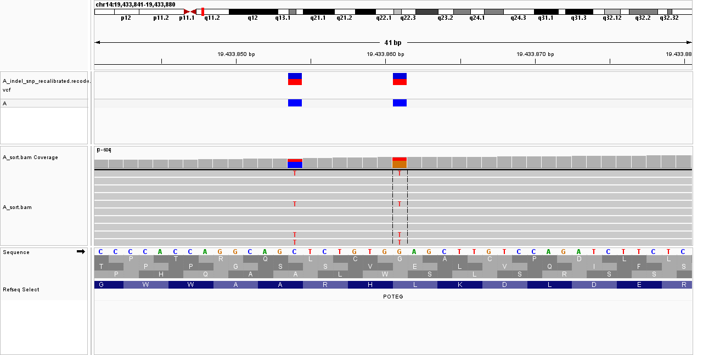
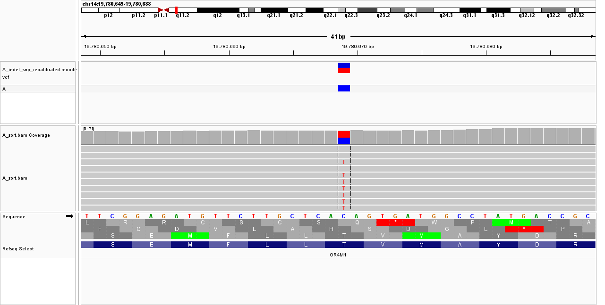
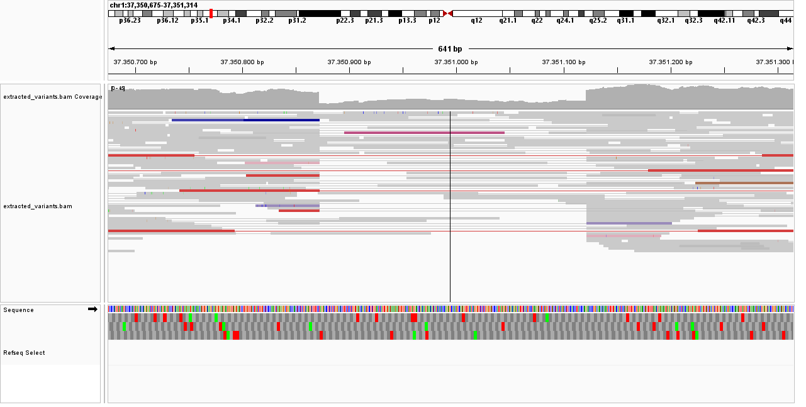
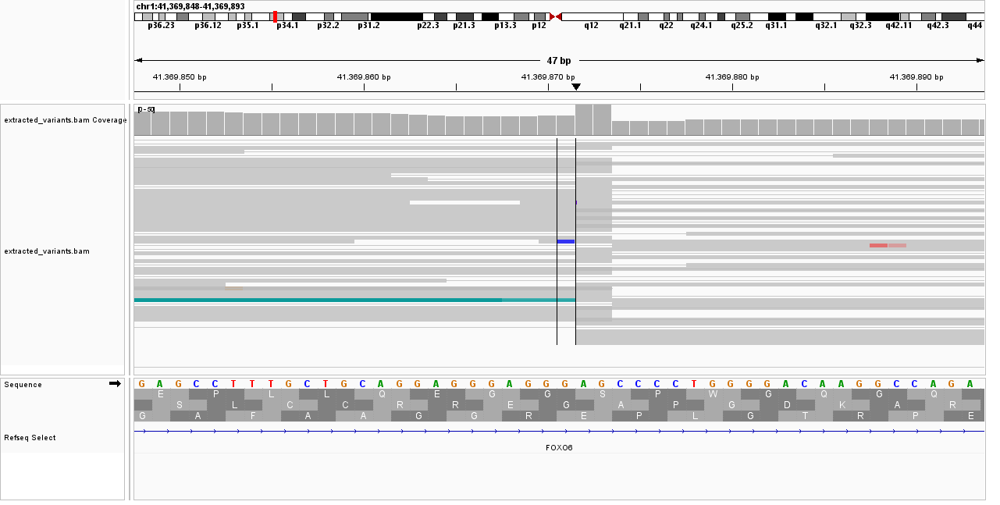
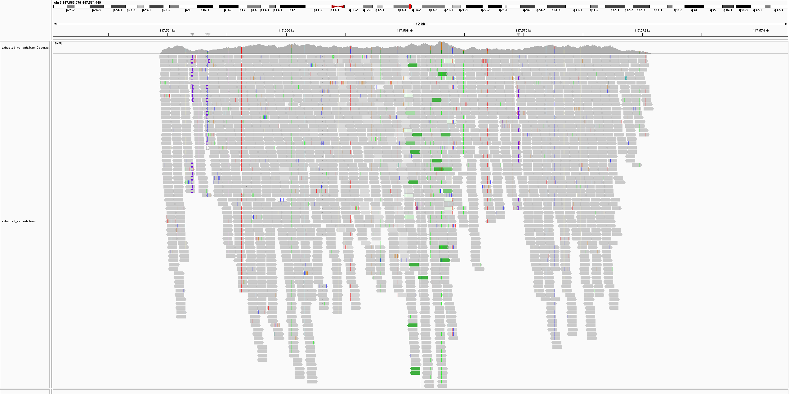

## Exercise

Good source for IGV tutorial : https://www.youtube.com/channel/UCb5W5WqauDOwubZHb-IA_rA

---
**Work on sample A**
Identify two variants: one with a moderate impact and one with a low impact. For each variant, answer the following:
* The variant type
* The REF and ALT alleles
* The genotype
* The exact read count supporting the REF and ALT alleles
* A screenshot of the variant captured from IGV

### Answers:

**Variant with low impact: chr14:19433861**
* The variant type: synonymous variant, SNP
* The REF and ALT alleles: REF: G and ALT: T
* The genotype: heterozygous (0/1), freq = 0.5
* The exact read count supporting the REF and ALT alleles: REF alleles: 
Total count: 307
G : 203 (66%, 181+, 22- )
T : 104 (34%, 93+, 11- )

* A screenshot of the variant captured from IGV

**Variant with moderate impact: Chr14: 19.780.669**
* The variant type: missense variant, SNP
* The REF and ALT alleles: REF: C and ALT: T
* The genotype: heterozygous (0/1), freq= 0.5
* The exact read count supporting the REF and ALT alleles: 
Total count: 53
C : 26 (49%, 13+, 13- )
T : 27 (51%, 12+, 15- )

* A screenshot of the variant captured from IGV

---

Using IGV, examine the structural variant (SV) in the `extract_variants.bam` file is this region
* chr1: 37350877 - 37351115
* chr1: 41369871 - 41369871
* chr2: 117564013 - 117572037 

and answer the following: 
**What type of structural variant do you believe this is?
Capture an IGV screenshot confirming the event. Make sure the reads are colored appropriately to support your conclusion.**

* chr1: 37350877 - 37351115> I think this SV is a deletion because the number of reads (indicated by the bar gray above) gets significantly smaller In other words, the coverage depth at this position is smaller than surrounding parts of the sequence. Moreover, multiple red reads span across this region, showing that read pairs are farther than expected due to this deletion.

    
*   chr1: 41369871 - 41369871> This region corresponds to an insertion, as indicated by the "I" sign. Also, reads end abruptly at the left line while many gray reads stop exactly at ~41,369,870 — these are soft-clipped at the breakpoint. The clipped bases contain the inserted sequence that can't map to the reference. Finally, the blue pair is closer together than expected because the sample has inserted sequence that the reference doesn't have. This is a clear insertion signal. The reference doesn't have the inserted sequence, so the two mates "collapse" toward each other when mapped — the mapped distance is smaller than the library insert size, which triggers blue coloring.

* chr2: 117564013 - 117572037>
Because the number of sequenced reads is higher than usual, I believe this variant is a duplication, but the whole region is quite messy. To confirm the duplication hypothesis, I click on one of the green strands that caught my eye - here it was stated duplication is indeed in question. On top of that, the number of reads (indicated by the bar gray above) is high, meaning the coverage depth at this position is larger than surrounding parts of the sequence. However, the whole region has multiple dips in coverage and multiple "I" signs which indicates that there are other possible SV present such as deletions/ insertions. As the region is also quite messy this is not so easily distinguishable.

